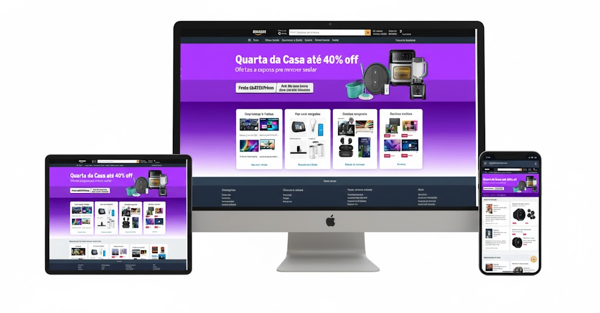

<!-- markdownlint-disable MD033 -->

# 🛒 Amazon Website Clone

Projeto desenvolvido como parte do meu aprendizado no **[Dev Club](https://www.devclub.com.br)**.

O **Amazon Website Clone** é uma recriação visual inspirada na **Amazon**, com foco em **HTML**, **CSS** e **responsividade**.

---

## 🚀 Tecnologias utilizadas

---

## 💻 Visualização do projeto

Você pode visualizar o projeto clicando na imagem abaixo:

---
## 🖼️ Demonstração

Adicione aqui uma imagem ou captura de tela do projeto:

<<<<<<< HEAD
![Amazon Website Clone]

## 🔗 Links úteis

- [🌐 Acesse o projeto online](https://adilsonribeiroalmeida.github.io/Amazon-website-Clone/)
- [💻 Repositório no GitHub](https://github.com/adilsonribeiroalmeida/Amazon-website-Clone)
- [👤 Meu perfil no GitHub](https://github.com/adilsonribeiroalmeida)

<!-- markdownlint-enable MD033 -->
